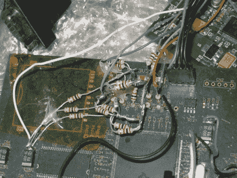

# 将 VGA 生成卸载到协处理器上

> 原文：<https://hackaday.com/2012/06/26/offloading-vga-generation-onto-a-coprocessor/>

[Alessandro]发给我们一个链接，链接到他关于 PRU 软件 VGA 光栅化器的帖子。这不是最容易的阅读，但我们认为它值得你花时间。

他背景信息的要点是，当他的公司开发 ARM9 处理器时，他想用协处理器芯片测试他的勇气。第一次迭代是编写一个字符 LCD 驱动程序，它从主处理器的内存中提取数据并显示在屏幕上。这是一个低开销的调试器显示，它也非常有限(两行 32 个字符并不能告诉你太多)。因此，他开始为可编程实时单元(PRU 是 TI 所说的协处理器)开发 VGA 生成器，该生成器可以像原始版本一样抓取内存中的数据。但是对于更大的显示区域，这对于调试非常有用。那个电阻堆就是他焊接在一起执行数模转换的 R2R 阶梯。在跳跃之后有一个快速演示剪辑。

这项工作最终可能对你有用。[Alessandro]报道说比格骨有类似的硬件。一点移植也能让他的生成器在那块板上工作。

[https://www.youtube.com/embed/HrhzNm8oJ4s?version=3&rel=1&showsearch=0&showinfo=1&iv_load_policy=1&fs=1&hl=en-US&autohide=2&wmode=transparent](https://www.youtube.com/embed/HrhzNm8oJ4s?version=3&rel=1&showsearch=0&showinfo=1&iv_load_policy=1&fs=1&hl=en-US&autohide=2&wmode=transparent)