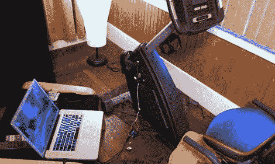

# 用谷歌街景在你的地下室骑自行车越野

> 原文：<https://hackaday.com/2012/06/26/bike-cross-country-in-your-basement-with-google-streetview/>

骑自行车越野是一项值得的追求，但之后你将不得不应对糟糕的司机、雨水、虫子和高温。lowendmac 的[Jeff Adkins]有一个巧妙的解决方案，不用离开地下室的安全和空调，就可以骑自行车游览这个国家。

对于他的体型，[杰夫]使用了一个磁性簧片开关连接到他的固定自行车的框架和踏板曲柄。每当转动踏板曲柄时，簧片开关在每转时闭合。这个簧片开关连接到一个新的 [Arduino Leonardo](http://arduino.cc/en/Main/ArduinoBoardLeonardo) 上，该开关被编程为踏板每旋转五圈就将键盘压力传输到计算机。从那以后，只需在笔记本电脑上加载谷歌街景，让 Arduino 在踩踏板时自动浏览街景图像。

[杰夫]项目的下一部分将是在他的固定自行车上添加左右按钮，以便在不把手拿开的情况下浏览谷歌街景图像。休息之后，你可以看看[杰夫]四处巡游的演示。

via [reddit](http://www.reddit.com/r/arduino/comments/vlq63/bike_across_the_country_while_in_your_basement_an/)

[https://www.youtube.com/embed/--h8UmIRdcs?version=3&rel=1&showsearch=0&showinfo=1&iv_load_policy=1&fs=1&hl=en-US&autohide=2&wmode=transparent](https://www.youtube.com/embed/--h8UmIRdcs?version=3&rel=1&showsearch=0&showinfo=1&iv_load_policy=1&fs=1&hl=en-US&autohide=2&wmode=transparent)