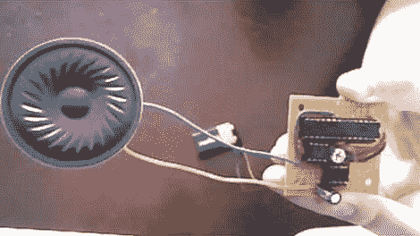

# Chiptune 播放器使用预处理。MOD 文件

> 原文：<https://hackaday.com/2012/06/27/chiptune-player-uses-preprocessed-mod-files/>

[Kayvon]刚刚基于 PIC 微控制器完成了这个 [chiptune 播放器的构建。硬件真的不能再简单了。他选择使用 PIC18F2685，只是因为它足够大，可以直接存储音乐文件，并且可以让他不必为此使用外部 EEPROM。输出引脚馈入数模转换器(DAC)芯片，该芯片进而将模拟音频输出至 LM386 运算放大器。夹在芯片之间的白色 trimpot 控制音量。](https://www.youtube.com/watch?v=SsBf6Veq-Ps)

这个项目的真正工作是编写一个翻译程序。MOD 文件转换成 PIC 能够播放的东西。由于芯片的内存限制，无法直接使用这些文件中的所有仪器样本。[Kayvon]编写了一个程序，它有一个很好的 GUI，可以让他加载音乐，并浏览每个乐器，以微调它们是如何被重新编码的。休息后的视频的音频轨道没有做项目正义，但你会得到一个很好的硬件和软件看看。

[https://www.youtube.com/embed/SsBf6Veq-Ps?version=3&rel=1&showsearch=0&showinfo=1&iv_load_policy=1&fs=1&hl=en-US&autohide=2&wmode=transparent](https://www.youtube.com/embed/SsBf6Veq-Ps?version=3&rel=1&showsearch=0&showinfo=1&iv_load_policy=1&fs=1&hl=en-US&autohide=2&wmode=transparent)