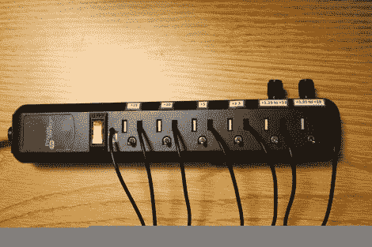

# 内置在电源板中的台式电源

> 原文：<https://hackaday.com/2012/06/26/bench-supply-built-in-a-power-strip/>

回到他的大学时代，[Print_Screen]厌倦了总是在他的试验板上建立电源。为了让原型制作更快，他想出了内置在电源板中的工作台电源。这一款使用线性调节器供电，并且在线路上产生的噪音比由开关模式 PSU 制成的[少得多。](http://hackaday.com/2012/06/26/building-a-bench-supply-without-altering-the-atx-psu)

首先，他需要降低电源电压，将交流电整流到 DC。他挖空了他能找到的最小的适配器，并设法将其安装到挖空的电源板中。它输出 15V 的电压，非常适合他选择的调节器。每个都有自己的插槽，插座在机箱上。接地孔已被一个拨动开关塞住，该开关将电源传送到自由形状的调节器/电容器/散热器模块。有一个 15V(直接来自转换器)、10V、5V、3.3V 的插槽，以及两个由插座上方的旋钮控制的可变调节器。我们从未见过这样的东西，觉得它非常棒！

[感谢 OverFlow636 via [Reddit](http://www.reddit.com/r/DIY/comments/vlxvn/i_always_see_pc_power_supplies_converted_into/)