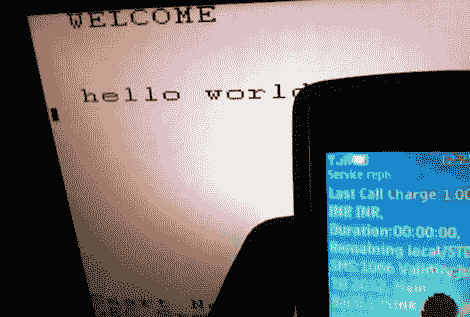

# VGA 留言板显示短信没有电脑

> 原文：<https://hackaday.com/2012/06/28/vga-message-board-displays-sms-without-a-computer/>

[Achu Wilson]的最新作品是[一个 VGA 留言板，可以通过 SMS 文本消息写入](http://blog.achuwilson.in/2012/06/smart-notice-board.html)。这起初听起来并不太有趣，直到你发现他是用微控制器而不是 PC 来做这件事。所有的复杂性都在驱动 VGA 的代码中。他在使用 8 位微控制器时，设法做到了没有任何抖动。

但是首先，事情的细胞方面。GSM 调制解调器负责连接。为了与调制解调器通信，[Achu]使用了 ATmega8。他提到，他本来可以使用更小的 uC，如 ATtiny，但这是他身边的东西。当收到一条消息时，ATmega8 将字符输入驱动 VGA 监视器的 ATmega16。他没有处理运行彩色显示器所需的模拟电压，而是简单地将三条彩色线组合在一起，并从微控制器的一个引脚驱动它们。这导致对应于电压或无电压的白色和黑色。

你可以看到他在广告之后展示了这个系统。

[https://www.youtube.com/embed/sg7snEejMzI?version=3&rel=1&showsearch=0&showinfo=1&iv_load_policy=1&fs=1&hl=en-US&autohide=2&wmode=transparent](https://www.youtube.com/embed/sg7snEejMzI?version=3&rel=1&showsearch=0&showinfo=1&iv_load_policy=1&fs=1&hl=en-US&autohide=2&wmode=transparent)