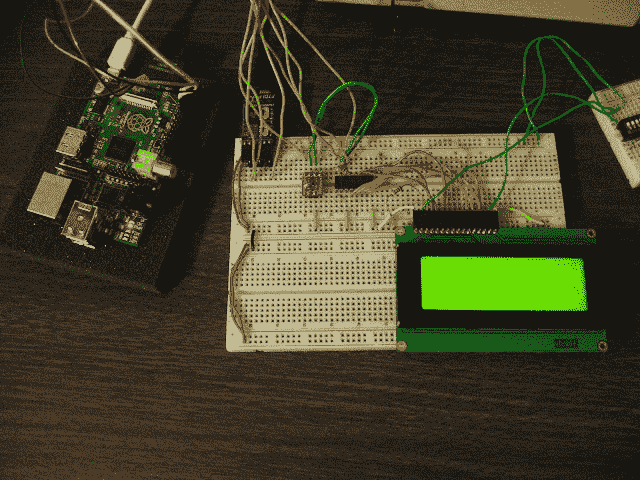

# 使用 HD44780 字符 LCD 和 Raspberry Pi

> 原文：<https://hackaday.com/2012/06/28/using-an-hd44780-character-lcd-with-the-raspberry-pi/>

[Tech2077]是已经拿到树莓派的幸运儿之一。他一直在研究 GPIO 头的不同接口选项，并刚刚发布了使用 RPi 的 HD44780 字符显示指南。我们喜欢这种方法，因为他用的不是[做一些核心的 LCD 工作](http://hackaday.com/2012/05/18/teaching-beaglebone-to-play-with-lidd-displays/)，而是你手头可能已经有的原型制作设备。

让一个字符液晶显示器运行应该很简单。问题在于器件之间的逻辑电平差距。如果你一直在使用 Arduino，你的插件可能意味着 5V 的电源轨和逻辑电平。RPi 输出 3.3V 逻辑。您可以使用电平转换器(在这种情况下，您至少需要转换 7 个引脚)，或者您可以更聪明一点。[Tech2077]获得了[一个 I2C 端口扩展器](http://hackaday.com/2008/12/27/parts-8bit-io-expander-pcf8574/)，它仅使用 2 条 RPi 线来寻址显示器的偶数行(4 个数据位加 3 个控制位)。这有点像黑客，因为 3.3V 逻辑比端口扩展器上数字 1 的推荐最小值低 0.2V。但它似乎工作得很好！如果不行，几个 NPN 晶体管也能做到。

寻址新外设只需加载 i2c 模块并编写一些 Python 代码。