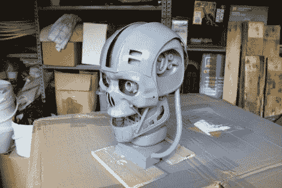

# 一元店终结者复制品

> 原文：<https://hackaday.com/2012/06/28/dollar-store-terminator-replica/>

好吧，现在我们认为[詹姆斯]只是在执行一项任务，看看他可以利用一元店作为他的零件箱来构建什么。这是《终结者**系列中接近完成的电子人骨架[复制品。它主要由价值 0.99 美元的东西制成。](http://xrobots.co.uk/terminator/)**

 **事实上，我们有点误解了。[James]确实在 0.99 商店购物，但概念基本相同。他已经向我们展示了他是这方面的专家，我们最近从他那里看到的电弧反应堆复制品。这一次，一组演讲者捐赠了他们的音箱来建立支撑头骨的脊柱。恰当地说，这些是用商店里的热胶枪粘在一起的。头骨的侧面由一套四个塑料碗精心制作而成。由于塑料盒盖的边角，下巴合在一起。最后，大部分的脸来自一个金色骷髅面具。把它喷成灰色，然后在眼睛上放一些发光二极管，他就完成了！休息之后，他在视频中展示了他的最终作品。

[https://www.youtube.com/embed/cNgbMmcJJ9A?version=3&rel=1&showsearch=0&showinfo=1&iv_load_policy=1&fs=1&hl=en-US&autohide=2&wmode=transparent](https://www.youtube.com/embed/cNgbMmcJJ9A?version=3&rel=1&showsearch=0&showinfo=1&iv_load_policy=1&fs=1&hl=en-US&autohide=2&wmode=transparent)**