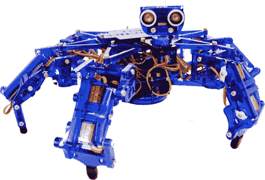
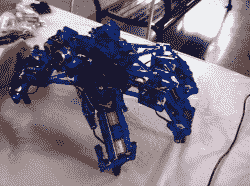
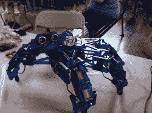
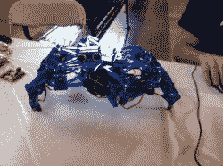

# MakerFaire K.C.: Hexy，200 美元的六足机器人项目

> 原文：<https://hackaday.com/2012/06/29/makerfaire-k-c-hexy-the-200-hexapod-project/>

我一直很喜欢六足动物。不幸的是，玩这些游戏的成本可能相当高。Hexy 正试图通过仅售 200 美元来对此产生可观的影响。是的，那 200 美元包括除了电脑以外的所有东西。你得到了整个底盘，微控制器，伺服系统，传感器，电池等。

我在 maker faire 遇到了来自 arcbotics 的 Joe，他正在向 T2 展示一个 hexy。他展示了一些光滑的动作，并解释了一些未来的升级。看起来他们打算在商业版本中使用金属齿轮，这可能会将成本推至 250 美元左右。在这个成本上，这个机器人可以与乐高 NXT 系统相媲美。

[https://www.youtube.com/embed/7mlq3d0Gd7c?version=3&rel=1&showsearch=0&showinfo=1&iv_load_policy=1&fs=1&hl=en-US&autohide=2&wmode=transparent](https://www.youtube.com/embed/7mlq3d0Gd7c?version=3&rel=1&showsearch=0&showinfo=1&iv_load_policy=1&fs=1&hl=en-US&autohide=2&wmode=transparent)

