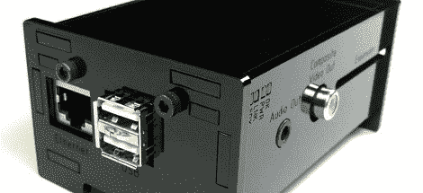

# Raspberry Pi 外壳将它变成了一台台式电脑

> 原文：<https://hackaday.com/2012/06/29/raspberry-pi-enclosure-turns-it-into-a-desktop-pc/>

当你还在等着你的树莓派被送到的时候，为什么不[为它建一个围栏](http://www.built-to-spec.com/blog/kit-instructions/raspberry-pi-enclosure-assembly-instructions/)？这个构建来自于[builttospec]富有成果的工作室，并且给了 Raspi 一个非常好的外壳，非常适合放在你的桌面上。

像大多数[builttospec]的案例一样，这个外壳是用激光切割机在丙烯酸树脂上制作的，具有你在一个好的 Raspi 外壳中所期望的一切功能。所有硬件端口都可用，还有一个用于 [GPIO 带状电缆](http://www.adafruit.com/products/862)的插槽，非常适合将封闭的 Raspi 连接到您正在进行的任何硬件项目。

我们喜欢[builttospec]外壳的一点是对光导管的优雅使用，光导管将 Raspi 上的 LED 指示灯发出的光汇聚到表壳表面。当然，它们只是一些激光切割的聚碳酸酯，但像这样的小接触可以将一个好的案例变成一个伟大的案例。

Thingiverse 上可用的文件[。](http://www.thingiverse.com/thing:25100)