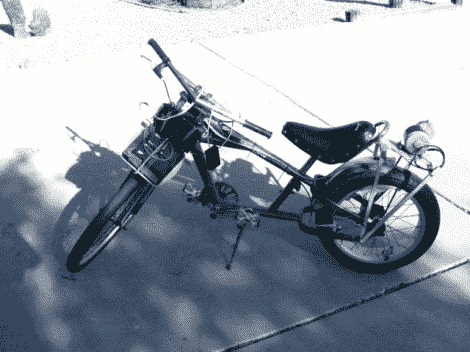

# 电动自行车(不含耳塞)

> 原文：<https://hackaday.com/2012/06/29/electric-bike-earplugs-not-included/>

很明显这辆自行车有一些多余的零件。但是仔细看，你会发现链环上没有链条。踩踏板不会让你有任何进展，因为[PJ·艾伦]改变了链条，以便使用电动马达驱动这辆自行车。

他有一台结实的发动机，在 24 伏电压下能输出 350 瓦的功率。对于速度控制，他选择使用 Arduino，向一些 MOSFETs 输出 PWM 信号。这导致了令人难以置信的噪音设置，你可以在休息后的台架测试视频中听到。但是一旦安装在自行车上，它就一点也不会安静下来。你能在一个街区外听到那东西。

最初的道路测试在试图从静止状态启动电机时烧毁了第一组 7A MOSFETs。听起来他选择的 40A 替代品成功了。我们没有看到任何关于电池寿命的信息，但如果他在城镇的另一边耗尽了电量，我们打赌他会希望他没有把链条连接到曲柄组上。

[https://www.youtube.com/embed/-wzjMyWF_gg?version=3&rel=1&showsearch=0&showinfo=1&iv_load_policy=1&fs=1&hl=en-US&autohide=2&wmode=transparent](https://www.youtube.com/embed/-wzjMyWF_gg?version=3&rel=1&showsearch=0&showinfo=1&iv_load_policy=1&fs=1&hl=en-US&autohide=2&wmode=transparent)

[https://www.youtube.com/embed/KFnr6sOt5iQ?version=3&rel=1&showsearch=0&showinfo=1&iv_load_policy=1&fs=1&hl=en-US&autohide=2&wmode=transparent](https://www.youtube.com/embed/KFnr6sOt5iQ?version=3&rel=1&showsearch=0&showinfo=1&iv_load_policy=1&fs=1&hl=en-US&autohide=2&wmode=transparent)