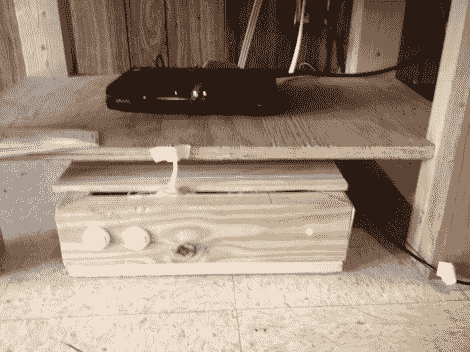

# 为兄弟会的电视遥控器打架

> 原文：<https://hackaday.com/2012/06/29/fighting-over-the-frats-tv-remote/>

[科林·布克曼]住在兄弟会的房子里，显然有线电视盒的遥控器有办法走开。他想出了一种方法，让每个人都能以某种形式控制电视频道。

可以看到有线电视盒放在那个架子上，而[科林的]附加物是放在地板上的木盒子。里面是一个 Arduino 板，从外壳中蜿蜒出来的电缆是一个红外 LED。这使得 Arduino 能够向电视盒子发送遥控命令。前面的两个按钮可以上下切换频道。

但这几乎不是遥控器的替代品，因为你必须站起来使用它，所以他走了几步。Arduino 板与以太网屏蔽配对。它提供了一个有虚拟键盘的网页。因此，任何拥有智能手机或笔记本电脑的人都可以登录服务器，开始更换频道。我们不确定这是否缓解了丢失的遥控器，或者当兄弟们不能就观看什么达成一致时，促进了即兴的拳击比赛。这无疑开启了远距离钓鱼的可能性，因为你可能正坐在教室里，决定每隔十分钟左右就把频道换到 Lifetime。

如果你手边没有以太网屏蔽，我们已经看到了类似的设置，使用蓝牙代替网络。