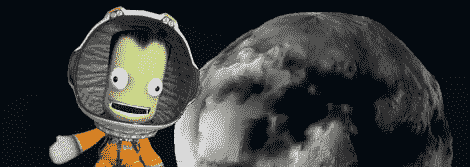

# 黑客日链接:2012 年 7 月 1 日

> 原文：<https://hackaday.com/2012/07/01/hackaday-links-june-1-2012/>

#### 打开非常旧的锁箱

[巴里威尔斯]是一个锁匠。一天，他接到一家博物馆的电话，这家博物馆有几个 17 世纪的结实盒子需要打开。在用内窥镜进行了一点探查之后，他决定用一点弹簧钢就可以把它们摘下来。盒子里是什么？[Barry]将在一两个月后发送更新。

#### 一个很棒的乔迪·拉·福吉护目镜。但是不要相信我的话。

制作了《星际迷航:下一代》中乔迪的护目镜的复制品。额外收获:这是莱瓦尔·伯顿的亲笔签名。

#### 为您的激光切割机提供免费镜子

如果你有一个激光切割机，你的镜子*会*被损坏，更换它们非常昂贵。[菲尔]提出了一个巧妙的建议:[用硬盘做你自己的镜子](http://diylaser.midwestlaserarts.com/2012/01/get-your-co2-laser-mirrors-for-free.html)。

#### 一部真正的 M.U.L.E .翻拍版

把卡坦的定居者和 M.U.L.E .结合起来..这就是这个 Kickstarter 试图做的事情，听起来很棒。

#### 这个游戏*太酷了*

几个月前，我绘制了一个视频游戏卫星 T1 的表面。从那以后，克巴尔太空计划有了巨大的更新，有了一个*号全新的月球。Reddit 上的*【InsanityCore】开始绘制这个新月，所以[我渲染了它](http://www.thingiverse.com/thing:26033)。去给[疯狂核心]一些因果报应。他做了所有艰苦的工作。