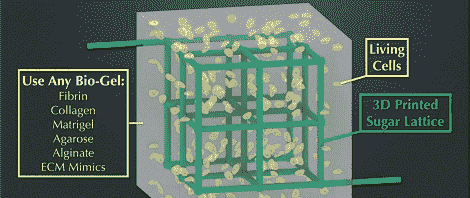

# 用 3D 打印机打印器官

> 原文：<https://hackaday.com/2012/07/02/printing-organs-with-a-3d-printer/>

宾夕法尼亚大学生物工程系的[乔丹·米勒]、[克里斯托弗·陈]和其他一群研究人员已经想出了一种用 3D 打印机打印 3D 组织的方法。在这种情况下，一个 RepRap 修改打印糖。

构建活体 3D 组织的传统方法面临一个问题——在活体中，有一大堆脉管系统将氧气和营养物质输送到内部细胞。在体外，这些营养物质无法到达大量组织核心的细胞。[Jordan]，[Chris]等人通过打印三维糖点阵解决了这个问题。将这种网格包裹在嵌有活细胞的凝胶中后，糖可以溶解，营养物质可以通过凝胶中现在中空的毛细管泵出。

如果你能接触到*自然*，全文文章[可在此处](http://www.nature.com/nmat/journal/vaop/ncurrent/full/nmat3357.html)获得。休息之后，还有一个很棒的视频展示了这种技术。

[https://www.youtube.com/embed/Yys1766j9js?version=3&rel=1&showsearch=0&showinfo=1&iv_load_policy=1&fs=1&hl=en-US&autohide=2&wmode=transparent](https://www.youtube.com/embed/Yys1766j9js?version=3&rel=1&showsearch=0&showinfo=1&iv_load_policy=1&fs=1&hl=en-US&autohide=2&wmode=transparent)