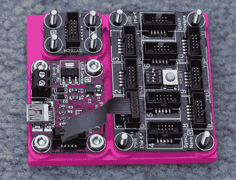

# 为业余爱好项目印刷安装板和盒子

> 原文：<https://hackaday.com/2012/07/02/printing-mounting-boards-and-boxes-for-hobby-projects/>

对于这些 Gadgeteer 组件来说，这是一个很好的基板。[Rob Miles]一直在为他的几个项目设计和[印刷安装板和外壳](http://www.robmiles.com/journal/2012/6/24/making-boxes-for-gadgets-with-an-ultimaker-printer.html)。他上周刚刚开始与终极制造商[一起印刷零件，我们可以说他已经找到了自己的方向。图中的板子有小块作为支撑物，下面有沉头孔，用于固定螺栓头。](http://hackaday.com/2011/10/13/ultimaker-quality-faq-is-like-porn-for-3d-printers/)

他开始用 Autodesk 123D 进行设计，但是界面并不真正适合他的工作风格。他转到了 FreeCAD，那段经历对他非常合适。他从草图视图开始绘制零件，然后将其挤压到 3D 模型中进行进一步细化，然后让打印机将数字转化为现实。这是他在短短一天的实验中生产的第三块板，但他也展示了他为热敏打印机制作的外壳。

如果你没有使用像这样有很好的安装孔的板，不要烦恼。我们已经看到了支撑电路板的 3d 打印安装系统，如[这些树莓皮外壳](http://hackaday.com/2012/06/26/building-better-cases-with-a-laser-cutter/)。

[谢谢彼得]