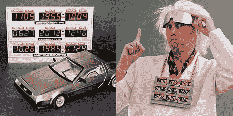

# 从时间电路教程开始思考第四维度

> 原文：<https://hackaday.com/2012/07/03/start-thinking-4th-dimensionally-with-a-time-circuit-tutorial/>

当[Phil Burgess]在 adafruit 的每周 vlog 上展示了一些 I2C 控制的七段显示器时，评论立即转向了每个人第二喜欢的时间机器中的时间电路，即*回到未来* DeLorean。[时间电路现在是活跃的](http://www.adafruit.com/blog/2012/07/02/great-scott-delorean-inspired-time-circuit-clock-with-adafruit-gear/)，所以现在你可以很容易地在悬停转换之前为你的汽车添加一个时间显示。

[菲尔]使用这些 LED 显示器，由四线 I2C 总线方便地控制。虽然显示器可以独立寻址，但只能将每个显示器分配到 8 个 I2C 地址中的一个。[Phil]在 74HC138 3 至 8 行解码器的帮助下，找到了一种控制时间电路 9 个显示器的简洁方法。

这个箱子是在 adafruit 的店里用透明的丙烯酸激光切割制成的，并喷涂了人造金属涂料。在安装了七段显示器之后，一个[小盒子](http://www.pjrc.com/teensy/)、[计时点](https://www.adafruit.com/products/255)和几节 AA 电池完成了这个构建。

如果运气好的话，激光切割箱的设计文件应该很快就可以得到，所以趁 I2C 显示器还在库存的时候去买吧。