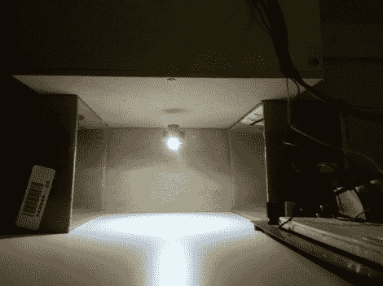

# 悬浮灯泡不用电线就能做到这一切

> 原文：<https://hackaday.com/2012/07/03/levitating-lightbulb-does-it-all-with-no-wires/>

用这些悬浮的无线灯做整个走廊会很有趣。这个项目[克里斯·里格尔]已经工作了大约六个月。它使用磁悬浮和无线电力传输[来创造一个真正整洁古怪的 LED](http://chrisrieger.com/LevLight.aspx)。

悬浮由灯组件上的永久磁铁和隐藏在外壳顶板另一侧的电磁线圈控制。该线圈使用 300 米的 20 AWG 电线。霍尔效应传感器用于提供关于灯单元位置的反馈，允许调节流向线圈的电流，以保持灯单元静止。当正常工作时，在 12V 时消耗大约 0.25A。

无线电力传输是通过一个由 1 MHz 交流电驱动的大线圈来实现的。该系统的这一部分在 12V 时消耗 0.5A，总功耗约为 9 瓦。不算太坏。休息之后，请观看[Chris 的]演示视频。

一种类似的将悬浮与能量转移相结合的方法[被用来使这个漂浮的球体旋转](http://hackaday.com/2010/08/31/floating-globe-hacked-to-rotate/)。

[https://www.youtube.com/embed/lnqdL1ZF6kI?version=3&rel=1&showsearch=0&showinfo=1&iv_load_policy=1&fs=1&hl=en-US&autohide=2&wmode=transparent](https://www.youtube.com/embed/lnqdL1ZF6kI?version=3&rel=1&showsearch=0&showinfo=1&iv_load_policy=1&fs=1&hl=en-US&autohide=2&wmode=transparent)