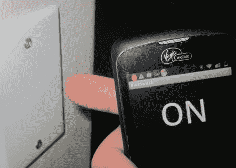

# [罗柏的]房子没有电灯开关

> 原文：<https://hackaday.com/2012/07/04/robbs-house-has-no-light-switches/>

所以[罗柏]想拔掉他家里所有的电灯开关。他的计划是用一个可以在他的智能手机上操作的系统来取代它们。但是他的妻子坚持认为一定有某种方法可以直接控制灯光——在这一点上我们不得不同意她的观点。解决方案是开发[一个通过触摸传感器或蓝牙](http://blog.theultimatelabs.com/2012/07/bluetooth-capacitive-touch-light-switch.html)开关灯的系统。

这个项目的触摸部分非常简单。他在一个空白出口板的背面涂上锡箔，然后用几个电阻将其连接到一个微控制器上。他使用的是 ATtiny85，可以使用 Arduino 草图进行编程，因此软件方面通过[cap sense 库](http://hackaday.com/2011/11/21/simple-touch-sensors-with-the-arduino-capsense-library/)变得很容易。该芯片还使用软件串行库与蓝牙模块通信。休息之后，你可以在演示视频中看到两者的结果。

当然，你需要在那里放一个继电器来切换电源，并找到一种给 uC 和蓝牙模块供电的方法。[RobB]配备了一个微型插入式 USB 电源转换器，并成功地将一切都安装在一个单组开关中。

[https://www.youtube.com/embed/zUvN5WG-Peo?version=3&rel=1&showsearch=0&showinfo=1&iv_load_policy=1&fs=1&hl=en-US&autohide=2&wmode=transparent](https://www.youtube.com/embed/zUvN5WG-Peo?version=3&rel=1&showsearch=0&showinfo=1&iv_load_policy=1&fs=1&hl=en-US&autohide=2&wmode=transparent)