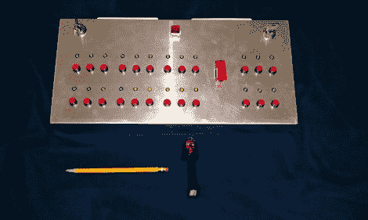

# 一个电阻的火热死亡用来发射烟花

> 原文：<https://hackaday.com/2012/07/04/a-resistors-fiery-death-used-to-launch-fireworks/>

看看这个[Awesome0749] [为发射烟花](http://imgur.com/a/U5ZzF)而建的控制中心。从他藏的东西来看，他要庆祝一番了。控制台是干净的，提供了一些安全功能，他刚刚升级到一个有趣的点火技术。

他用 CAT5 电缆连接烟火。在外壳的顶部，你只能看到杏仁色墙板的边缘，每个墙板都有三个插孔。必须打开控制器上的两个按键才能给设备供电。中间还有一个安全拨动开关。

通过 1/4 瓦 24 欧姆电阻运行 70 伏直流电，点火[开始。正如你在休息后的演示中看到的，这很快导致了火焰。我们在演示中看到的另一件事是，当系统启动时，只有连接的按钮的 LED 才会亮起。我们没有看到原理图，但他一定是接线了，所以系统会检查连续性，以确保按钮的业务端有接线。](http://www.reddit.com/r/electronics/comments/vzxwz/update_this_is_my_fireworks_control_box_handbuilt/)

[https://www.youtube.com/embed/A-MoPe0oY_0?version=3&rel=1&showsearch=0&showinfo=1&iv_load_policy=1&fs=1&hl=en-US&autohide=2&wmode=transparent](https://www.youtube.com/embed/A-MoPe0oY_0?version=3&rel=1&showsearch=0&showinfo=1&iv_load_policy=1&fs=1&hl=en-US&autohide=2&wmode=transparent)