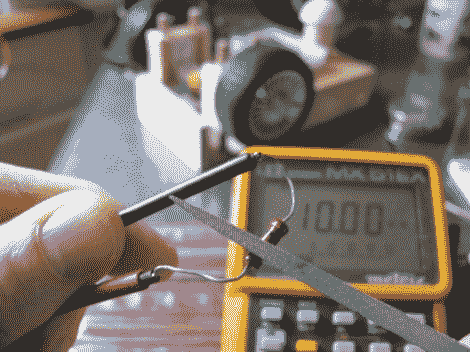

# 酷的孩子都把他们的电阻归档以保证准确性

> 原文：<https://hackaday.com/2012/07/05/the-cool-kids-all-file-their-resistors-for-accuracy/>

这里有一个小贴士可以放在你的后口袋里，你可以用一个金属锉来调整你的电阻。[Gareth]在休息后的视频中展示了这一技术。一个金属文件是字面上所有你需要做一些微调。只要确保你是从碳膜电阻开始，因为这将不会与金属膜品种。

他的例子显示了一个 10k 的电阻，其万用表读数仅为 9.92k。但是他恰恰需要 10k。穿过保护层后，他用一个小锉刀来回锉几次，每次增加大约 20 欧姆的电阻。现在，他确实提到了过度的深度切割会损害电阻器的额定功率。但如果操作正确，这肯定不会破坏它。原来这就是它们在工厂里被调整的方式。

他提到的一个可能的用途是在被黑的伺服电机上调整平衡。

[https://www.youtube.com/embed/OQDjjIvLaj4?version=3&rel=1&showsearch=0&showinfo=1&iv_load_policy=1&fs=1&hl=en-US&autohide=2&wmode=transparent](https://www.youtube.com/embed/OQDjjIvLaj4?version=3&rel=1&showsearch=0&showinfo=1&iv_load_policy=1&fs=1&hl=en-US&autohide=2&wmode=transparent)

[谢谢大卫]