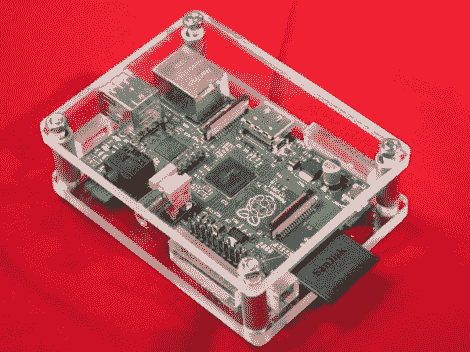

# 丙烯酸 RPi 案件，你可以不用数控机床

> 原文：<https://hackaday.com/2012/07/06/acrylic-rpi-case-you-can-make-without-a-cnc-machine/>

[Simon Inns]正在展示他用丙烯酸树脂制作的树莓派盒子。它比[一个薄薄的电影盒子](http://hackaday.com/2012/07/05/flimsy-pi-case-still-provides-a-level-of-protection/)提供了更多的保护，但它的制作也更复杂一些。不，这不需要激光切割，但为了获得漂亮的边缘，[西蒙]使用了带锯，许多人在他们的商店里已经没有。问问周围的人，或者去当地的黑客空间看看。只需要几分钟就能切下零件。

这听起来像是 8 毫米或 6 毫米丙烯酸将为这个项目工作。铝管作为一个垫片来保持两个主要的板材在适当的位置。RPi 板本身由几块放置恰当的丙烯酸块超级胶水固定。在休息后嵌入的视频中，你可以看到整个制作过程，包括用火炬倒圆切割边缘。

[https://www.youtube.com/embed/ndQXTnen2T0?version=3&rel=1&showsearch=0&showinfo=1&iv_load_policy=1&fs=1&hl=en-US&autohide=2&wmode=transparent](https://www.youtube.com/embed/ndQXTnen2T0?version=3&rel=1&showsearch=0&showinfo=1&iv_load_policy=1&fs=1&hl=en-US&autohide=2&wmode=transparent)