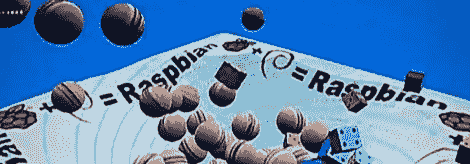

# Raspi 上的 OpenGL

> 原文：<https://hackaday.com/2012/07/06/opengl-on-the-raspi/>

也许我们过于关注树莓派的硬件方面了。当然，通过 GPIO 引脚将 Raspi 连接到外部世界是很酷的，但是我们不要忘记我们在这里处理的是一个成熟的 Linux 系统。[chris]尽最大努力将 OpenGL 图形的力量引入树莓派，让我们保持警惕。

以前， [OpenGL ES](http://www.khronos.org/opengles/) 只对 xorg 可用，但是【chris】成功地增加了对 [Raspbian](http://www.raspbian.org/FrontPage) 的支持。有一个[很棒的物理演示](http://www.youtube.com/watch?v=dbG6sQskxoQ)【克里斯】放在一起展示了 128 个球体和立方体在一个平面上弹跳。

现在，[chris]正在寻找在 Raspi 上制作加速 3D 图形的样本和教程。你可以在[【Chris】‘Git](https://github.com/chriscamacho/gles2framework)获取所有代码，如果你愿意帮忙的话，可以通过树莓 Pi 论坛上的[联系他。](http://www.raspberrypi.org/phpBB3/memberlist.php?mode=viewprofile&u=17050)

与任何图形演示一样，休息后请查看视频。

[https://www.youtube.com/embed/884rHzIp9dU?version=3&rel=1&showsearch=0&showinfo=1&iv_load_policy=1&fs=1&hl=en-US&autohide=2&wmode=transparent](https://www.youtube.com/embed/884rHzIp9dU?version=3&rel=1&showsearch=0&showinfo=1&iv_load_policy=1&fs=1&hl=en-US&autohide=2&wmode=transparent)
[https://www.youtube.com/embed/NsQpn3Z3U-s?version=3&rel=1&showsearch=0&showinfo=1&iv_load_policy=1&fs=1&hl=en-US&autohide=2&wmode=transparent](https://www.youtube.com/embed/NsQpn3Z3U-s?version=3&rel=1&showsearch=0&showinfo=1&iv_load_policy=1&fs=1&hl=en-US&autohide=2&wmode=transparent)
[https://www.youtube.com/embed/QuzdWwQyJbo?version=3&rel=1&showsearch=0&showinfo=1&iv_load_policy=1&fs=1&hl=en-US&autohide=2&wmode=transparent](https://www.youtube.com/embed/QuzdWwQyJbo?version=3&rel=1&showsearch=0&showinfo=1&iv_load_policy=1&fs=1&hl=en-US&autohide=2&wmode=transparent)