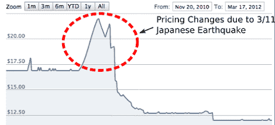

# 利用 Octopart 的历史定价进行数据挖掘并节省资金

> 原文：<https://hackaday.com/2012/07/06/data-mining-and-saving-money-with-octoparts-historical-pricing/>

[Greg Shikhman]今年夏天在 Octopart 做软件开发实习生。在他为其他开发人员买咖啡的间隙，他想出了 10 月份上市的数千种组件的历史价格

有很多很酷的数据，比如 555 定时器的价格信息。我们猜测一些人在 5 月底左右缺货，这解释了为什么他们卖 1.68 美元一件。如果你想寻找零部件，不妨看看 Octopart 的历史价格指数。去年八月买了一个 [PIC 单片机](http://octopart.com/detail/history?sid=11767447858)就是掷骰子；一天之内，价格从 5 美元涨到 2 美元多一点。

有了这些数据，甚至可以挖掘与运输和库存问题无关的真实生活事件的数据。日本制造商瑞萨(Renesas)在去年的地震中遭受重创，这在他们一款微控制器的历史价格中有所体现。对于一个实习生的项目来说还不错。