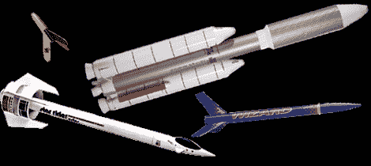

# 问黑客日:一些模型火箭黑客怎么样？

> 原文：<https://hackaday.com/2012/07/09/ask-hackaday-how-about-some-model-rocket-hacks/>

没有什么比早上黑火药的味道，以及发射模型火箭后空气中的兴奋和燃烧的推进剂更好的了。所有那些 60 年代、70 年代、80 年代和 90 年代的孩子可能都记得模型火箭发动机的种类——通常是 A、B、C 和 D 尺寸的发动机，用于推动你的带有轻质翼片的纸板管上天。

在过去的几年里，模型和业余火箭界发生了很大的变化。2009 年，特里波利火箭协会打赢了一场针对酒精、烟草、火器和爆炸物管理局的诉讼，因为 T2 允许向任何人出售高氯酸铵火箭发动机。这场官司花了将近 10 年才告一段落，但最终任何人都可以走进 Hobby Lobby，手里拿着 D、E、F 和 G 引擎出来。甚至我们的老对手，埃斯蒂斯火箭队，也通过推出[几个令人敬畏的 G 动力套件](http://www.estesrockets.com/rockets/pro-series/rockets)进入了游戏。有了这些现成的发动机，任何人(至少在美国)都可以发射重量不到 1500 克(3.3 磅)的 G 动力模型火箭，而无需认证。

考虑到这一点，我们正在征集模型火箭黑客。如果你把一个微控制器驱动的高度计项目放在一起，*棒极了*。[在](http://hackaday.com/contact-hack-a-day/)发送。车载摄像机？太好了！即使你建造了一个巨大的泰坦 IIIe(或 Estes 星际骑士，个人最喜欢的)的复制品，把那个东西送进去。如果你想要一个巨大的土星 V，要打破的记录是[1/10 比例模型](http://www.youtube.com/watch?v=dHnk6ulSNSo)，所以开始吧。