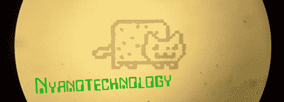

# 在家自制集成电路

> 原文：<https://hackaday.com/2012/07/09/make-your-own-integrated-circuits-at-home/>

你在上面看到的那只猫从头到尾只有 600 微米。客观地说，这大约是人类头发直径的 10 倍。此外，Nyan 被蚀刻成 200 纳米厚的铜箔，是 HomeCMOS 团队的工作成果，他们正在开发一种业余爱好者友好的工艺，在家中制作集成电路和 MEMS 设备。

这个项目远未完成；HomeCMOS 公司还没有生产出一个可以工作的集成电路，但是考虑到所涉及的设备和工具数量很少，一些实验——让湿蚀刻完全成功，甚至让 T2 制造出一个几乎可以工作的量子量子比特——是非常了不起的。

HomeCMOS 团队还没有真正制造出集成电路或 MEMS 设备，[Jeri Ellsworth]已经通过在家里制造晶体管和集成电路证明了这是可能的。虽然 HomeCMOS 实验室不会很快推出具有数百万晶体管的芯片，但很可能会看到一些小规模集成技术，如几个逻辑门或调节器。