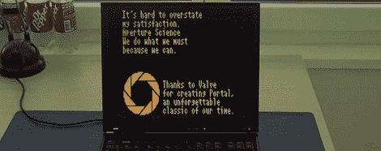

# DCPU 的可引导仿真器

> 原文：<https://hackaday.com/2012/07/09/bootable-emulator-for-the-dcpu/>

《我的世界》背后的家伙[Notch]目前正在开发一款名为 0x10c 的新游戏。这款游戏包括一台名为“DCPU”的 16 位电脑，它让人回想起 20 世纪 80 年代的微型电脑，其硬件架构非常怪异。[Benedek]认为将他的 ThinkPad 变成 DCPU 是一个好主意，所以他[为 DCPU](http://www.youtube.com/watch?v=UqefqWol1Cw)编写了一个可引导的 x86 仿真器，它完全符合当前的 DCPU 规范。

这个可启动的 DCPU 模拟器来自于[Benedek]卓有成效的工作室，他们是在 DCPU 上绘制分形的[和模拟比特翻转辐射](http://www.youtube.com/watch?v=uQyNIhderlw&feature=channel&list=UL)的[背后的大脑，他们甚至将](http://www.youtube.com/watch?v=yrKyc6omR1c&feature=channel&list=UL)[的门户结束演职员表](http://www.youtube.com/watch?v=Dul0XaV4Dzk&feature=channel&list=UL)放入[notch]的 0x10c 计算机中。

[Benedek]编写了这个新的 x86 汇编，允许它在没有操作系统的情况下从任何旧笔记本电脑上的 USB 闪存驱动器启动。这允许到目前为止为 DCPU 实现的所有东西的直接硬件通信。

如果你想运行你的裸机 DCPU，[Benedek] [提供了所有可用的文件](https://bitbucket.org/benedek/x86-dcpu/)。因为整个模拟器只有 1800 行 x86 汇编，所以可以从软盘上加载；我们将在[notch]的新游戏中看到一项古老的技术。

哦。还有一件事。当我们被介绍到 0x10c 时，[我们说我们将举办一场竞赛](http://hackaday.com/2012/04/08/getting-12-year-olds-to-learn-assembly-programming/)评选 DCPU 的最佳硬件实现。我们仍然在等待一些硬件规格的发布(硬盘和基于 MIDI 的串行接口)，所以当有一个可玩的 alpha 版本发布时，我们可能会举行。虽然[Benedek]的可引导模拟器是一个很好的开始。