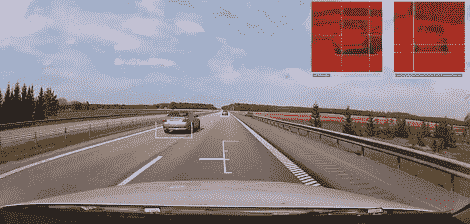

# 基于视频的汽车雷达

> 原文：<https://hackaday.com/2012/07/09/video-based-radar-for-your-car/>

[Gustaf]已经研究机器视觉有一段时间了，并在我们的提示线上提交了他的最新项目。这是一个基于视频的汽车雷达系统，可以在高速公路上行驶时检测摄像头视野内的汽车。

像[Gustaf]以前的机器视觉实验一样，他让一台计算机识别并计算黄色圆柱体和绿色矩形，雷达构建使用了[ADABoost](http://cseweb.ucsd.edu/~yfreund/adaboost/)和[a forge AI/机器视觉 C#框架](http://www.aforgenet.com/framework/)。[Gustef]使用进化算法来检测视频帧中汽车的存在，首先从预先录制的视频中选择 150 幅汽车图像，另外 1850 幅图像由计算机选择，并由人眼确认为汽车。

凭借其数据库中的 2000 张汽车图像，[Gustaf]的机器视觉算法能够在汽车行驶在美丽的瑞典高速公路上时实时检测到汽车。除了在视频帧中的每辆车下方覆盖一个矩形，并在右上角覆盖一个可怕的终结者风格的 HUD 之外，[Gustaf]还在他的汽车引擎盖上方显示距离。

这是一个令人敬畏的建造，让我们想知道[Gustef] [是否正在建造一辆自动驾驶汽车](http://hackaday.com/2011/10/23/all-about-the-google-autonomous-vehicle-project/)。即使他不是，这真的让我们想在我们的鞭子上安装一个视频 HUD，只是为了看看这在行动中。