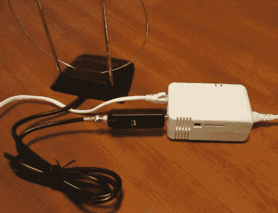

# 使用 Linux Wall wart 远程实现软件定义无线电

> 原文：<https://hackaday.com/2012/07/09/software-defined-radio-remotely-using-a-linux-wall-wart/>

这里有一个有趣的想法:如果上面看到的硬件被放置在某个位置，[您可以通过互联网](http://www.digifail.com/projects/pwnsdr.shtml)远程监控无线电信号。[MS3FGX]已经考虑这个想法有一段时间了。他希望将 DVB 加密狗与便携式 Linux 解决方案配合使用，以提供软件定义无线电(SDR)功能，而无需实际到场。

白色的盒子是 PWN 插头，是 SheevaPlug 的品牌版本。插入其中的黑色转换器是 DVB 调谐器转换器。它的本意是通过无线电接收电视信号，但最近硬件被用作实现 SDR 的简单方法。将两者(连同天线)结合起来，接入网络连接，你就得到一个远程监听站。你能听什么？任何在加密狗带宽范围内的东西。[MS3FGX]提到了对讲机通信和寻呼机信号，仅举两个例子。

他甚至写了一个安装脚本，可以让你立刻启动并运行。