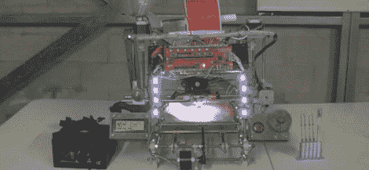

# RA 3D 打印机控制器板无所不能，有迪斯科灯

> 原文：<https://hackaday.com/2012/07/10/ra-3d-printer-controller-board-does-everything-has-disco-lights/>

3D 打印机正变得比一台四轴塑料喷射数控机器复杂得多。如今，你真的没有赢得你的极客信誉，除非你在你的 3D 打印机上黑了一个 LCD 和 SD 卡接口，或者至少试验了多台挤出机。然而，每个人都在使用的控制板有一个问题:大多数板都没有足够的输出引脚，这大大减少了 3D 打印机可以做的酷事情的数量。

输入 RA。这是一款新的 3D 打印机控制器板,带 IO，可用于任何想象得到的设置。在 RA 的特性列表中，我们想知道为什么我们以前没有看到这些特性。一个 24 针 ATX 电源接头直接焊接到板上，给 RA 用户一个愚蠢的简单方法来给他们的打印机供电。当然，还有 led 输出，相机触发器(打印机延时电影真的很酷)，光环，蜂鸣器，LCD/旋转编码器/SD 卡控制面板，以及对巨型打印机的两个加热床的支持。如果用一种颜色打印对你来说还不够好，RA 支持三台挤压机

与其他 3D 打印机板如 [RAMPS](http://reprap.org/wiki/RAMPS) 或 [Sanguinololu](http://reprap.org/wiki/Sanguinololu) 相比，这块板上的输出数量简直令人惊叹。如果你计划建造一个巨大的、功能丰富的 3D 打印机，你可能没有比 RA 提供的更好的了。