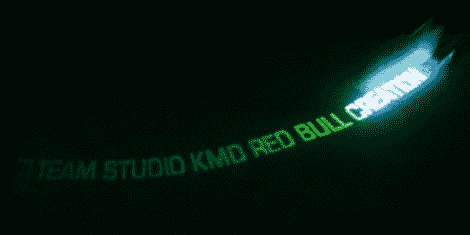

# 黑暗留言板中的激光充电辉光

> 原文：<https://hackaday.com/2012/07/10/laser-charged-glow-in-the-dark-message-board/>

红牛创作大赛的参赛作品[使用激光为夜光留言板](http://studiokmd.com/2012/07/red-bull-creation/)充电。这个概念我们已经见过几次了。由于光可以激发磷光表面，在表面上移动光像素会留下褪色的痕迹。最近我们看到[一个旋转的戒指留言板](http://hackaday.com/2011/09/09/spinning-uv-light-writer/)。这次竞赛的不同之处在于，棋盘是固定的，而打印头是移动的。

它基本上是一个带有激光二极管的两轮机器人，可以垂直于行进方向旋转。这样，激光打印行，机器人的运动负责推进列。由于激光具有难以置信的强度，它能够比 led 更彻底地激发磷光体。因此，这一信息将比那个旋转环项目或这个令人敬畏的转盘黑客项目持续更长时间。不要错过休息后的视频，展示了黑客以及一个充满戏剧效果的包。

[https://www.youtube.com/embed/7dg2JCnndjc?version=3&rel=1&showsearch=0&showinfo=1&iv_load_policy=1&fs=1&hl=en-US&autohide=2&wmode=transparent](https://www.youtube.com/embed/7dg2JCnndjc?version=3&rel=1&showsearch=0&showinfo=1&iv_load_policy=1&fs=1&hl=en-US&autohide=2&wmode=transparent)