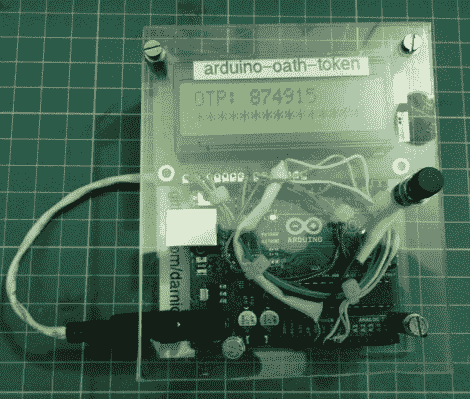

# 基于时间的一次性密码和 Arduino

> 原文：<https://hackaday.com/2012/07/11/time-based-one-time-passwords-with-an-arduino/>

通过[构建自己的 Arduino OATH 系统](http://lab.infoserver.com.br/wiki/index.php/Projects:arduino-oath-token)，体验基于时间的一次性密码(TOTP)安全性。OATH 是一个开放的标准认证系统，它提供了一个生成令牌的平台，使您的登录比仅使用密码更安全。

许多发行基于硬件的远程登录加密狗的公司都采用 TOTP 的方法。这种安全性[可能已经受到损害](http://hackaday.com/2011/04/13/rsa-securid-two-factor-authentication-comprimised/),但它仍然比单独的密码要好。另外，如果你是围绕 Arduino 开发的，我们敢打赌你只是在尝试学习，而不是真正负责保护工业或国家机密。

硬件设置只需要一个 Arduino 板，一个按钮和一个屏幕作为用户界面。由于板有一个晶体振荡器，它保持相当准确的时间(只要它保持供电)。它将每三十秒推出一个新令牌。休息后的视频显示，Arduino 计算的值确实与测试框显示的相匹配。

[https://www.youtube.com/embed/tK3mZGlEy40?version=3&rel=1&showsearch=0&showinfo=1&iv_load_policy=1&fs=1&hl=en-US&autohide=2&wmode=transparent](https://www.youtube.com/embed/tK3mZGlEy40?version=3&rel=1&showsearch=0&showinfo=1&iv_load_policy=1&fs=1&hl=en-US&autohide=2&wmode=transparent)