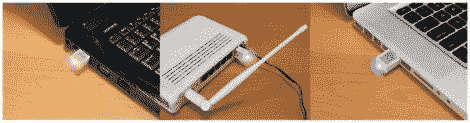

# BlinkM 升级为 USB 大众市场设备

> 原文：<https://hackaday.com/2012/07/11/blinkm-gets-upgraded-to-a-usb-mass-market-device/>

[TodBot]有了一个新的硬件。他的 Blink(1)目前在 Kickstarter 上获得了大约 50%的资金。这是一个 USB 小块，里面有一个 RGB LED。当插入计算机时，它可以用作状态指示器。起初，这听起来令人失望，但他的营销非常棒，因为无数的用途真正吸引了我们的注意力。如果你在路上，你可以用它来报告你的服务器统计数据。将一个插在每个机架式服务器上，以便快速直观地指示哪个服务器崩溃了。还是找到自己的用处。

你可能记得[TodBot]是 BlinkM 的创造者。最近他称之为世界上最小的 Arduino。这个 Blink(1)也作为 Arduino 可编程的产品在市场上销售。电路板尺寸差不多，都有一个 RGB LED 模块。不同的是，BlinkM 有一个 ATtiny85，需要一个串行转换器对其进行编程。这有一个 USB 插头，所以我们敢打赌他把微型换成了 ATmega8u2 或同一家族的东西。

不要以为一个闪亮的 LED 就能解决问题？对于只需要更高分辨率的人来说，还有其他硬件选项。例如，这个项目给你[一个无线 8×8 RGB led 显示屏，用作指示器](http://technabob.com/blog/2012/07/08/l8-smartlight/)。