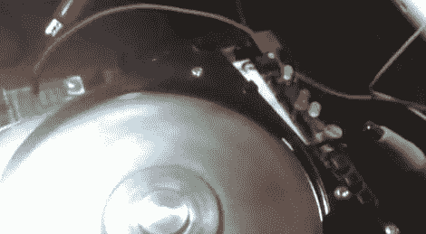

# 重新利用旧硬盘组件

> 原文：<https://hackaday.com/2012/07/12/repurposing-old-hdd-components/>

[IronJungle]有一个旧硬盘占用了他工作间的空间，所以他把它拆了，[写信来提醒我们这些旧硬件有多么有用。除了提供难以置信的强大磁铁和甜甜圈形状的镜子，硬盘还带有一个可靠的步进电机。](http://ijprojects.blogspot.com/2012/07/repurpose-old-disk-drive-as.html)

他将旧驱动器拆开，将两个步进电机引脚连接到驱动器的一对插头引脚上。这使得他只需将一个小的 JST 连接器连接到驱动器的背面，就可以轻松地访问步进器产生的信号。

从那里，他可以将驱动器用于任何目的。出于讨论的目的，[IronJungle]用它来闪烁一个 LED，如下面的视频所示——他自愿承认这不是什么了不起的壮举。然而，步进电机可以用于各种各样的项目，既简单又复杂。请务必在评论中分享你最喜欢的废旧硬盘马达的用途。

[https://www.youtube.com/embed/3frk13eTn3I?version=3&rel=1&showsearch=0&showinfo=1&iv_load_policy=1&fs=1&hl=en-US&autohide=2&wmode=transparent](https://www.youtube.com/embed/3frk13eTn3I?version=3&rel=1&showsearch=0&showinfo=1&iv_load_policy=1&fs=1&hl=en-US&autohide=2&wmode=transparent)