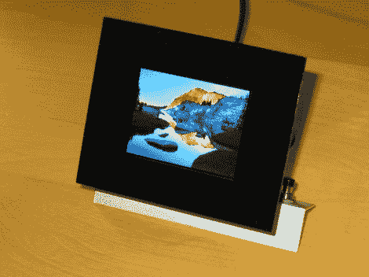

# 旋转以匹配图像方向的数码相框

> 原文：<https://hackaday.com/2012/07/12/digital-picture-frame-that-rotates-to-match-image-orientation/>

这个[数码相框物理旋转，以匹配图像的方向](http://dangerousprototypes.com/forum/viewtopic.php?f=56&t=4294)。[Markus Gritsch]构建了这个框架，其中包括一个 Python 脚本，可以将照片转换为一种能够充分利用 2.4 英寸 LCD 屏幕的格式。

PIC 32MX120F032B 处理器对屏幕进行 8 位并行寻址。图像以原始格式从 SD 卡读取，每个像素的 16 位颜色被推送到显示器。为了将它们转换成这种格式，[Markus']脚本将 JPEG 文件转换为 RAW，调整它们的大小，使用抖动来减少到 16 位颜色，然后应用锐化滤镜来改善最终的外观。在此过程中，它还包括方向信息。该信号被微控制器解析并用于驱动屏幕所连接的伺服电机。

为了完成这个项目，他喷涂了一块丙烯酸作为框架的边框。休息后看看演示，我们认为你会同意旋转功能，以及图像滚动，真的让你想把它放在自己的桌子上。

[https://www.youtube.com/embed/yGzvt1zctiU?version=3&rel=1&showsearch=0&showinfo=1&iv_load_policy=1&fs=1&hl=en-US&autohide=2&wmode=transparent](https://www.youtube.com/embed/yGzvt1zctiU?version=3&rel=1&showsearch=0&showinfo=1&iv_load_policy=1&fs=1&hl=en-US&autohide=2&wmode=transparent)