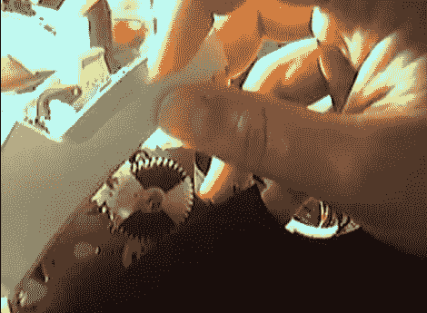

# 黑掉一台兄弟热敏打印机使用非 OEM 连续辊

> 原文：<https://hackaday.com/2012/07/13/hacking-a-brother-thermal-printer-to-use-non-oem-continuous-rolls/>

你可以花 65-75 美元买到一台兄弟热敏标签打印机。但是如果你不想买兄弟品牌的连续进纸，那你就不走运了。除非你完成了这个让你用兄弟 QL-500 打印机使用任何热敏纸的任务。

由于纸卷背面印有图案，打印机与 OEM 纸捆绑在一起。它基本上是一个由间隔规则的黑色矩形组成的编码条。当然，也有其他品牌带有这种图案，但如果你想使用没有这种图案的纸张，秘密在于移动读取这种条带的传感器。

绝妙的解决方案是使用一个白色的进给齿轮作为编码器轮。【CheapSkateVideo】用一个魔术笔把齿轮相对的两个四分之一涂成黑色。然后，他取下光学传感器，将其放在表壳面向方向盘的一侧。它需要沿着齿轮的半径调整，直到时机刚刚好，但是一旦你准备好了。传感器是一种安全功能，可确保打印机中有介质。如果没有，你可以烧坏打印头，所以记住这一点。休息后看视频里的解释。

[https://www.youtube.com/embed/9XCLxk8-MtI?version=3&rel=1&showsearch=0&showinfo=1&iv_load_policy=1&fs=1&hl=en-US&autohide=2&wmode=transparent](https://www.youtube.com/embed/9XCLxk8-MtI?version=3&rel=1&showsearch=0&showinfo=1&iv_load_policy=1&fs=1&hl=en-US&autohide=2&wmode=transparent)