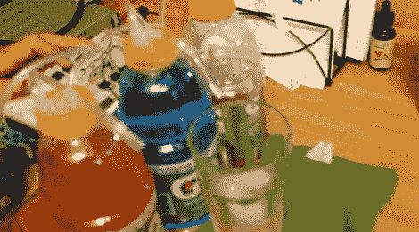

# 按下按钮，任何口味的运动饮料

> 原文：<https://hackaday.com/2012/07/13/any-flavor-sports-drink-at-the-push-of-a-button/>

[Sage Spate]对橙色、蓝色或红色运动饮料的乏味口味不满意。他决定通过制造这种混合口味的饮料自动售货机来混合口味。

他修改了每个瓶子的盖子，使之与气压系统配合工作。这样一来，瓶子本身就成了容器，空了也能很容易地更换。每个瓶盖有两个开口，一个由分配器喷嘴使用，并包括一根软管，可一直延伸到瓶底。另一个孔连接到气泵。瓶内压力的升高迫使运动饮料上升并流出分配器软管。

一个气泵用于所有三个带有一组螺线管的容器，以单独启动每种口味。[Andreas]发来了提示，提到一些零件是从喷墨打印机中回收的，但我们不确定是哪些零件。无论如何，项目的下一步是添加 Arduino 控件，这将允许基于预设配方的[自定义混音。](http://hackaday.com/2010/02/17/drink-making-unit/)

休息之后我们嵌入了演示视频。

[https://www.youtube.com/embed/xXgiJLKgVpY?version=3&rel=1&showsearch=0&showinfo=1&iv_load_policy=1&fs=1&hl=en-US&autohide=2&wmode=transparent](https://www.youtube.com/embed/xXgiJLKgVpY?version=3&rel=1&showsearch=0&showinfo=1&iv_load_policy=1&fs=1&hl=en-US&autohide=2&wmode=transparent)