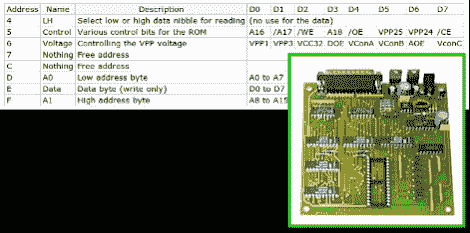

# 入侵并行端口闪存编程器

> 原文：<https://hackaday.com/2012/07/14/hacking-a-parallel-port-flash-memory-programmer/>

[Pulko Mandy]不经常使用他的 flash ROM 编程器，但他确实使用它。当他试图获得对新芯片的支持时，制造商建议他只购买一个更新的版本[,他决定改为黑掉程序员及其软件](http://pulkomandy.tk/projects/avrstuff/wiki/EPROxygen)。

这个设备连接到并行端口，并打算用于 MS-DOS 系统(难怪该公司不再支持)。该板使用逻辑芯片来增加读写功能。因此，第一步是分析它们是如何连接在一起的，并提出一组命令。在此期间，他还对电路板进行了一些更改，使电压更符合规格，并确保并行端口上的逻辑电平符合正确的电压。

他的计划是将该板用于 Linux 系统，这样并行端口接口就可以保留下来。他利用从硬件检查中学到的东西，用 C++编写了自己的接口。它在一个他能够在 MS-DOS 软件下使用的芯片上工作，但是他还没有让它在引发这次冒险的芯片上工作。如果你熟悉 AT29C040A 的工作原理，请考虑伸出援手。