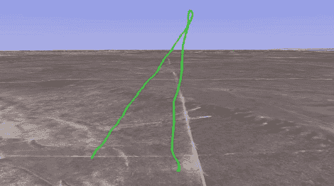

# 无人机硬件的火箭遥测技术

> 原文：<https://hackaday.com/2012/07/16/rocket-telemetry-from-uav-hardware/>

当我们发布火箭黑客和建设的呼吁时，我们期望看到一些高度传感器，也许是一个或两个 GPS 模块。显然，我们忘记了类似的硬件在遥控飞机领域非常受欢迎，并且可以成功地添加到火箭上，正如[凯文]和他的配备 J 发动机火箭的向我们展示的那样

ArduPilot 是一种小型 Arduino 可比板，专为无人机、四轴飞行器和其他不由火箭发动机驱动的旋转飞行器设计。为了从他的火箭上获得实时遥测数据，[凯文]安装了一个 GPS 接收器和一个 XBee 发射器。当[在 H165 发动机](http://www.pmscientist.net/arduino/ardupilot/ardurocket-first-flight)上发射时，【凯文】能够保持无线电锁定他的火箭，允许他实时下载数据。

使用 ArduPilot 收集飞行数据有一些缺点；ArduPilot 只报告地面速度，如果车辆直线行驶，这是一个有些无用的功能。此外，[凯文]没有办法将数据记录到 SD 卡上；地面团队必须能够接收 XBee，以免数据丢失。对于大多数火箭来说，无线电问题应该不是问题。[Kevin]在 J 马达上启动了[相同的硬件，并能够从 3600 AGL 接收数据。](http://www.pmscientist.net/arduino/ardupilot/ardurocket-mhm-2k11)