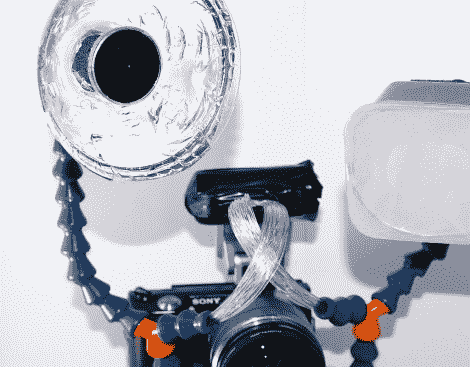

# 光纤双闪光适配器

> 原文：<https://hackaday.com/2012/07/17/optical-fiber-twin-flash-adapter/>

商用双闪适配器的价格标签总是让[Marcell]望而却步。他决定看看他能从自己制作的闪存适配器中获得什么样的性能。

使用的原材料应该看起来很熟悉。光纤就像一个导管，可以改变闪光灯发出的光的方向，但是他需要一种方法来固定住它们。他选择使用[锁线](http://locline.com/)。这是一种我们经常在数控加工厂看到的产品，用于将碎片从刀头上吹走。它是中空的，并保持其位置。这是完美的，因为它允许容易调整，并提供了一个通道，光纤可以通过路由。这里使用的 Y 适配器连接到一个硬板底座，该底座连接到相机底部的安装凸耳。[Marcell]建议如果可能的话使用 T 形件，因为 Y 形配件会使光纤难以穿过。