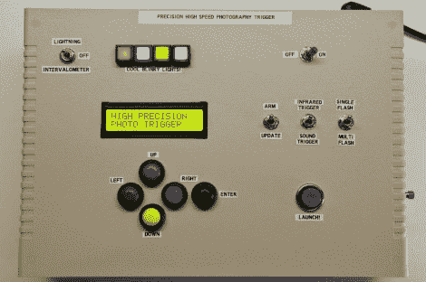

# 用于捕捉水滴的高速摄影控制器

> 原文：<https://hackaday.com/2012/07/17/high-speed-photography-controller-built-to-catch-water-droplets/>

[一个高速摄影控制器统治他们所有人](http://mrossphoto.com/wordpress32/phspt/)。如果你想拍摄一个静止的水库上溅起的水滴，这就是你要找的。但如果你不是，它仍然为其他高速需求提供了令人难以置信的灵活性。在里面你会发现一个 Arduino Mega，它有足够的空间让你随心所欲。

[迈克尔·罗斯]是这个盒子后面的人。他想要一个能做所有事情的系统；计时、水滴控制、相机快门等。上图中看不到的是这个机箱背面的接口面板(这张照片显示的是机箱的顶部)。休息后的视频会让你看看整体设置。它有控制两种不同光源的端口，使用红外传感器或通过声音拍摄图像的探测器(我们正在考虑[子弹摄影](http://hackaday.com/2011/06/05/faking-high-speed-video-photography-of-repetitive-events/))，以及控制电磁阀的四个端口。

他制作了一个庞大的 PDF 教程，可以指导最大的新手完成整个构建过程。在上面链接的他的网站上找到它。

[https://www.youtube.com/embed/mE36YjJpYpQ?version=3&rel=1&showsearch=0&showinfo=1&iv_load_policy=1&fs=1&hl=en-US&autohide=2&wmode=transparent](https://www.youtube.com/embed/mE36YjJpYpQ?version=3&rel=1&showsearch=0&showinfo=1&iv_load_policy=1&fs=1&hl=en-US&autohide=2&wmode=transparent)