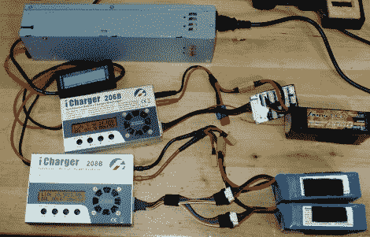

# 改变 PSU 服务器的用途，满足您的充电需求

> 原文：<https://hackaday.com/2012/07/17/repurposing-server-psu-for-your-charging-needs/>

照片顶部的灰色方框是用于机架式服务器系统的模块化电源装置。[Sebastian]决定[将其重新用作 RC 电池的充电电源](https://sites.google.com/site/tjinguytech/my-projects/HP47A)。他选择这款惠普 DPS-600PB 是因为它的额定功率和效率，而且你可以以合理的价格获得它们。

这是一个积极的功率因数校正(APFC) PSU，他说，提请 40%的电流比非 APFC 品种。因为他有时在野外用发电机给电池充电，这是一大优势。但是在它能被用作一个来源之前，一点修改是必要的。

由于这是一个机架设备，它的背面有一组连接器。对于电源，有铲形连接器与机架上的鳍片相匹配。他将正负导线焊接在铁锹之间，以便与电池充电器连接。如果不在机架中，PSU 就不会启动，因此还需要添加一些跳线来连接三个接口引脚。

随着他的改装全部完成，他继续使用两个 PSU 作为 24V 电源，[将它们放入一个漂亮的手提箱中，同时使用它](https://sites.google.com/site/tjinguytech/my-projects/diy-24v-47a)。