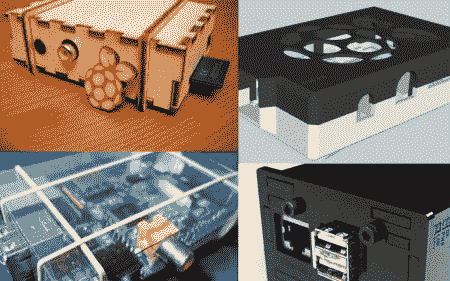
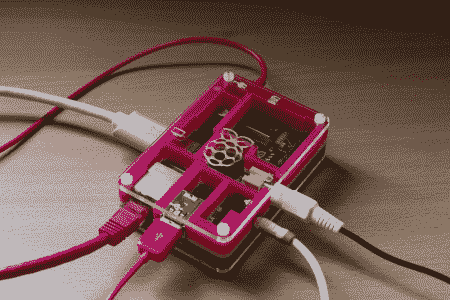
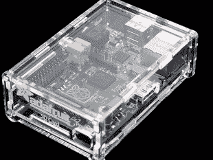

# 覆盆子 Pi 案例综述

> 原文：<https://hackaday.com/2012/07/24/raspberry-pi-case-roundup/>

如果你还没听说过，那么现在[树莓派]在[HAD]上风靡一时，为什么不收集一些优秀的案例呢？

【Nhslzt】来信告诉我们他的[激光切割树莓 Pi](http://www.etsy.com/listing/93162730/bramble-pi-raspberry-pi-laser-cut-finger "laser cut Raspberry Pi case") 指接案例。这些东西在美国售价仅为 12 欧元，约合 14.95 美元。当然，最近汇率可能对美国不利，但这比去德国德累斯顿旅行便宜，在那里，部分利润将用于在那里建立一个创客空间！

如果你对添加式 3D 打印 DIY 过程更感兴趣，为什么不下载一个并在你的打印机上制作呢？[Thingiverse]有一个[精选案例](http://www.thingiverse.com/search?q=raspberry+pi+case&sa=Search "Thingiverse Raspberry Pi Case")许多案例的特点是，正如你可能已经猜到的，顶部有一个覆盆子的图片！(这是打印的[案例，图为](http://www.thingiverse.com/thing:27009 "Raspberry Pi case 3D printed"))。

最后，为了更丰富多彩的东西(见休息后的图片)，你不能得到比[更好的【Pibow】](http://www.raspberrypi.org/archives/1640 "Pibow")。如果你正在寻找一些色彩丰富，非常坚实(如描述)的东西，这可能是你的情况！您可以[在这里](http://www.pibow.com/ "order Pibow")订购一个，或者使用独特的设计来激发您自己的灵感(Thx Brian！).

至于我们已经在 HAD 上写过的东西，[这个箱子](http://hackaday.com/2012/06/29/raspberry-pi-enclosure-turns-it-into-a-desktop-pc/ "[HAD] Raspberry Pi Case")看起来非常光滑，由黑色丙烯酸制成，[这个](http://hackaday.com/2012/06/26/building-better-cases-with-a-laser-cutter/ "laser cutter case")也是如此，结合了激光切割机和 3D 打印机的使用。当然，如果你想要严格实用的型号，你可以选择用橡皮筋和胶带绑在一起的[一号！](http://hackaday.com/2012/07/05/flimsy-pi-case-still-provides-a-level-of-protection/ "flimsy Raspberry pi case")

[在 Adafrtuit](http://www.adafruit.com/products/859) 也有一个很好的，像他们的其他项目一样，它是[开源的](http://www.thingiverse.com/thing:24461)，所以如果你有激光打印机，你可以自己剪，并带有[完整教程](http://learn.adafruit.com/pi-box)。

