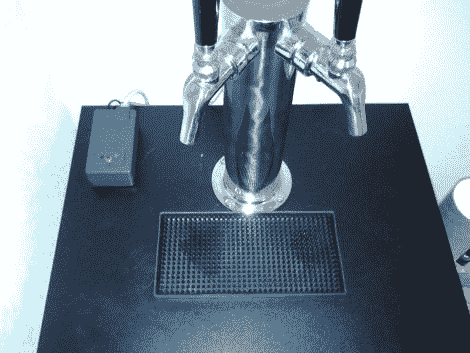

# 当你拿着一杯冰啤酒坐下来的时候，Kegerator 在未打开的 pd 上计算你的品脱数

> 原文：<https://hackaday.com/2012/07/18/kegerator-tallies-your-pints-on-untappd-while-you-sit-back-with-a-cold-one/>

[Jeff]承认他非常沉迷于“未开发的 pd ”,一个他描述为啤酒的四方网站。像其他啤酒迷一样，他喜欢报告自己喝了多少品脱啤酒，即使这些啤酒碰巧来自他自己储藏的家酿啤酒桶。unset PD 当然支持这种程度的奉献，但[对[Jeff]来说，每次他在自己舒适的家中给自己倒一杯冷饮时，都需要拿起手机，这似乎很愚蠢。](http://www.3d0g.net/brewing/untappd-kegerator)

他环视了一下房间，发现一个 Arduino 无所事事，于是他着手建立一个系统，让他可以在不使用智能手机的情况下自动记录自己的饮酒习惯。该系统并不复杂，使用流量传感器测量倾倒量，并使用其“check-in”API 将结果上传到 Untappd。[杰夫]肯定会在他的构建中包括其他几个有用的功能，包括一个锁定定时器，防止在简单地喝完一品脱时多次签到，以及“邻居模式”，让你为朋友倒一轮酒而不记录倒酒。

请务必在[Jeff 的]网站上查看完整的构建，并让我们知道您是否在家里用您的小桶设置做了同样酷的事情。