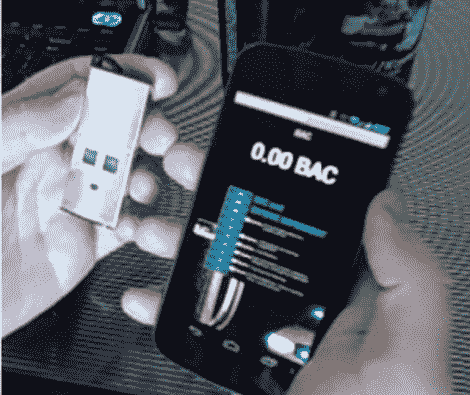

# Sensordrone 真的让你的手机变成了三色机

> 原文：<https://hackaday.com/2012/07/18/sensordrone-really-does-make-your-phone-a-tricoder/>

[Sensordrone 是一款充满传感器的无线加密狗](http://www.kickstarter.com/projects/453951341/sensordrone-the-6th-sense-of-your-smartphoneand-be)，用于智能手机或其他类似计算机的设备。但也许这可以更好地解释为让你的智能手机像最初的《星际迷航》三录仪一样工作的东西。在一个 had 中，您有显示数据的主单元，在另一个 had 中，您拿着传感器阵列，您可以在事物面前挥动它来读取读数。

这实际上只是一个蓝牙模块，电池，一些传感器，和一个突破头都包装在一个漂亮的盒子里。但看到它在休息后的视频中使用，确实让我们有点头晕。该分接头可让您选择将 Sensordrone 连接至 RS-232 或 I2C 设备。第一个演示是一台热敏打印机从 Android 手机发送打印任务。但是加密狗不仅仅是一个通行证。它配备了一系列传感器(案例中的三个窗口)，用于气体传感、温度、湿度、压力、颜色传感，或许还有其他一些传感器。

[https://www.youtube.com/embed/4KhmvFn0MC4?version=3&rel=1&showsearch=0&showinfo=1&iv_load_policy=1&fs=1&hl=en-US&autohide=2&wmode=transparent](https://www.youtube.com/embed/4KhmvFn0MC4?version=3&rel=1&showsearch=0&showinfo=1&iv_load_policy=1&fs=1&hl=en-US&autohide=2&wmode=transparent)