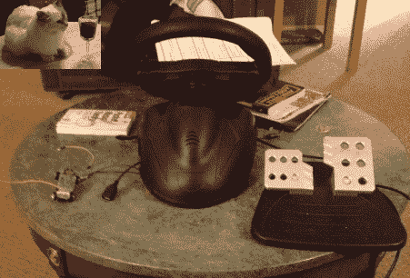

# 小型遥控汽车，全尺寸控制器

> 原文：<https://hackaday.com/2012/07/19/small-rc-car-full-size-controller/>

[诺亚·法林顿]在他非常有趣的博客上发来了他最新的黑客攻击；[将赛车街机控制器转换成遥控遥控他的遥控车](http://noahfarrington.wordpress.com/2012/07/18/making-an-rc-car-awesome-again/)。他免费拿起了街机控制器，并决定用它来控制一辆遥控汽车会酷得多。他选择在这个项目中不使用 Arduino，而是用硬逻辑来完成。然而，他确实在设计过程中使用了 Arduino * phew *来解决 RC 控制板的工作问题。与 Arduino 解决方案相比，最终的电路板非常简单，只需几个运算放大器、一个稳压器和一些无源元件。对于诺亚声称是他的第一个大项目之一来说，这一点都不坏。也许他会在不久的将来发布一段视频。