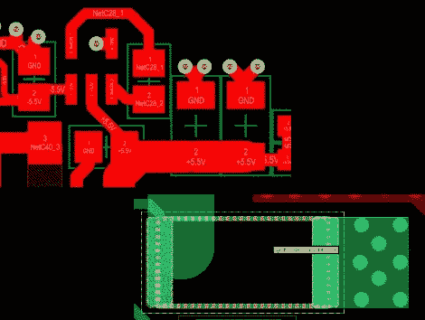

# Altium 和 Cadence PCB 布局工具对比

> 原文：<https://hackaday.com/2012/07/19/comparing-altium-and-cadence-pcb-layout-tools/>

我们看到许多项目使用 Eagle 进行原理图和 PCB 布局。有一些使用 Kicad，但我们很少听到其他替代方案。最近，[Limpkin]一直在与 Altium 和 Cadence 合作，并写了他们在 PCB 布局方面如何比较。这两者都不是免费的，所以在冒险之前最好知道你将会遇到什么。

[Limpkin]在开始概述时提到原理图编辑器是可比较的；差异开始在 PCB 布局工具中显现出来。在这里，您可以看到 Altium 总是标记焊盘，这样您就知道每个焊盘属于哪个网络。如果您将鼠标悬停在焊盘上，Cadence(其 PCB 布局工具称为 Allegro)将显示网络。两者都有 3D 渲染，Altium 的看起来更令人愉快，但它到底有什么实际用途呢？好吧，我们承认[我们喜欢一个好的逼真的板渲染](http://hackaday.com/2012/06/05/this-is-not-real-lifelike-renderings-from-eagle-files/)，但是我们跑题了。一旦迹线都在板上，需要重新调整，最有趣的差异就会显现出来。Cadence 实际上会自动移动其他层上的迹线，以避免与迟到的过孔发生冲突，Altium 在拖动迹线时会显示一些奇怪的行为。[Limpkin]没有给出最终的判断，但仅仅是比较就值得一读。