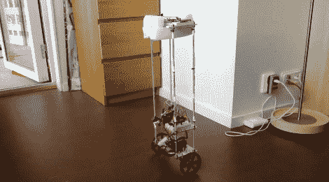

# 自平衡机器人使用级联 PID 算法

> 原文：<https://hackaday.com/2012/07/20/self-balancing-robot-uses-cascading-pid-algorithms/>

在这一点上，我们开始认为建造一个自平衡机器人是除了闪烁一些 led 和在 LCD 屏幕上写 Hello World 之外的通行权利之一。我们并不是说像这样的产品很容易实现。但是这个项目让你学到了很多广泛的话题，并真正推动你的技能更上一层楼。这个最新的产品来自[塞巴斯蒂安·尼尔森]。他[使用三种不同的微控制器让两轮车自己站立](http://sebastiannilsson.com/en/k/projekt/selfbalancing-robot/)。

他用了我们最喜欢的快速制作材料螺杆和丙烯酸。身体比我们习惯看到的要高得多，为了防止不可避免的坠落，他使用了一些泡沫包装材料来保护顶层。三个不同的 Arduino 板一起工作。一个监控每个车轮的速度和方向。另一个监控 IMU 板的位置和运动反馈，最后一个板结合来自其他板的数据并负责平衡。两种 PID 算法提供预测性校正，首先通过分析车轮运动，然后将数据输入使用 IMU 反馈的第二种算法。它平衡得非常好，甚至可以被推挤而不掉落。休息后在片段中自己看吧。

[https://www.youtube.com/embed/QH83A746gS0?version=3&rel=1&showsearch=0&showinfo=1&iv_load_policy=1&fs=1&hl=en-US&autohide=2&wmode=transparent](https://www.youtube.com/embed/QH83A746gS0?version=3&rel=1&showsearch=0&showinfo=1&iv_load_policy=1&fs=1&hl=en-US&autohide=2&wmode=transparent)