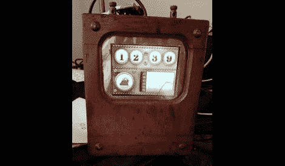

# 构建蒸汽朋克风格的时间和天气显示

> 原文：<https://hackaday.com/2012/07/21/building-a-steam-punk-style-time-and-weather-display/>

这是数字天气显示器。由于天气显示在智能手机无处不在的今天，他特意给它一个独特的外观。他从一个木制伏特计盒开始，将古老的显示器换成了现代的液晶显示屏。

他使用 Gadgeteer 组件进行改造。液晶显示器的图像存储在 SD 卡上，需要时显示。因为无论时间或环境条件如何，数字表圈都是一样的。驱动系统的. NET 框架。他用洋红色为所有的表盘开口制作了一幅图像。这样，sprite 就可以只用于变化的数字、天气图标和图形区域。

纵观项目编码的所有内容，我们认为 Gadgeteer 组件非常适合那些精通高级语言但不想处理低级微控制器问题的人。

[谢谢乔治]