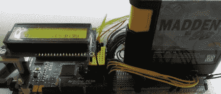

# 在实验板上阅读世嘉手推车

> 原文：<https://hackaday.com/2012/07/24/reading-sega-carts-off-a-breadboard/>

*金斧子*很棒，*索尼克 3* / *索尼克和指关节*组合是 16 位时代的最高艺术作品之一，但对于我们这些没有可用的 Genesis 或 Megadrive 的人来说，我们不得不使用其他人提供的 rom。[Lee]想出了一种简单的方法，使用容易清理的部件和 Arduino Mega 从这些旧的 Sega 墨盒中读取数据，为基于 Arduino 的 ROM 转储器铺平了道路。

Sega Genesis 卡盒底部的连接器有一个 2×32 引脚，通常需要 64 个连接才能真正读取卡。这些连接器并不容易获得，但[Lee]确实设法找到了一些 2×31 针连接器，它们以旧 ISA 插座的形式存在。Genesis cart 的外部引脚用于[接地和一个“盒式插入”插槽](http://nintendoallstars.w.interia.pl/romlab/genconn.htm)，在锉掉一个旧 ISA 连接器的末端后，[Lee]发现他实际上可以读取这些旧游戏盒式磁带上的数据。

这些旧的世嘉手推车上有 49 个数据和地址引脚，因此需要将 Arduino Mega 混合使用，以实际读取 ROM 芯片上的一些数据。到目前为止，[Lee]可以从购物车中读取数据，但是目前只能读取存储在 0x80 中的许可数据。尽管如此，还是很酷，这是迈向 Arduinofied Sega cart dumper 的第一步。