# 牛头怪的复仇:决斗迷宫

> 原文：<https://hackaday.com/2012/07/28/the-minotaurs-revenge-dueling-labyrinths/>

你可能没注意到，我们最近参加了一个竞赛。红牛创作大赛。基本的想法是，他们给我们 72 小时来建立一个基于主题的东西。12 个队比赛时，整个过程将进行现场直播。主题是“游戏中的游戏”，规则非常简单。它必须是一个有明确赢家的游戏(不要太笼统)，它必须是安全的，它必须适合他们的集装箱。

我们的项目被称为“牛头怪的复仇”，基本上是一套决斗迷宫。一对巨大的倾斜迷宫，在试图触发对手桌上的陷阱时必须控制。我们知道连续三天看我们把木头拧在一起会很无聊，所以我们额外努力让我们的食物有趣。我们安排了一些活动，比如喷火、涂鸦艺术家、穿着戏服的人，以及一直发生的奇怪事情。我们花时间回答问题，并与我们的观察者交谈。它的回报，我们的饲料通常是主机两倍于任何其他饲料的观众。

请继续阅读关于一切是如何制造的完整文章，以及大量图片和一些视频。

[https://www.youtube.com/embed/9Nj3h8XNjtQ?version=3&rel=1&showsearch=0&showinfo=1&iv_load_policy=1&fs=1&hl=en-US&autohide=2&wmode=transparent](https://www.youtube.com/embed/9Nj3h8XNjtQ?version=3&rel=1&showsearch=0&showinfo=1&iv_load_policy=1&fs=1&hl=en-US&autohide=2&wmode=transparent)

基础建设始于一个坚固的框架。主要由胶合板和中密度纤维板制成，框架必须足够坚固，以承受桌子的重量，人们玩桌子时发出的砰砰声，以及运输可能带来的影响。
 

“游戏场”必须能够像桌面版本一样在 x 和 y 轴上旋转。我们研究了其中一些是如何构建的，并最终决定采用两部分系统。在桌子的中心点有一个万向架作为枢轴，还有一个缆绳系统把两边拉到我们需要的方向。中间的万向架允许桌子支撑更多的重量，并且仍然具有充分的 x 和 y 移动性。

万向架由一整块 4 英寸的 PVC 制成。我们简单地在 PVC 上钻了 4 个相对的孔，并把它们作为我们的铰链点。正如你在照片中看到的，这给了我们比我们需要的更大的活动范围。

通过一个简单的滑轮系统来控制 X 和 Y 轴。我们有一个轴连接我们的杠杆到一个中心点，在那里一些乙烯基涂层的晾衣绳连接。然后，它穿过一个滑轮，到达桌子每个轴的中心。当你转动杠杆时，桌子就会倾斜。

操场本身是用钉板和 1 英寸×2 英寸的木头建造的。我们在墙上钻孔并钉上钉子，这样它们就能直接落入钉板中，但我们发现一点点热胶水有助于它们牢牢固定。这个钉板实际上很容易抬起来，所以可以用不同类型的迷宫来代替。

在电子方面，我们最终使用 PicAxe 微控制器来处理我们的伺服系统。每张桌子有 8 个伺服系统，由对面桌子上的街机按钮触发。代码相当简单。按下按钮时，启动伺服系统。等待几秒钟，关闭伺服系统。在允许重新激活之前多等几秒钟，以便球可以逃脱。

这意味着你可以做任何简单的伺服可以完成的事情。我们用它们来升高/降低桌子下面的磁铁，以及打开/关闭迷宫中的路径。磁铁惊人地有效，闸门完全如你所料地工作。

最后，我们有足够的时间添加一些花哨的装饰，添加杯架，在桌子上画一些漂亮的点缀，并在展示之前调整运动范围。它工作得相当完美！

团队学分:

【卡莱布·卡夫】
【斯科特·绍尔】
【菲利普·布鲁萨德】
【尼克·塔尔】
【安德鲁·米泽尔】
【布莱恩·兹韦林克】
【肖恩·麦基】
【迈克·斯奇斯】
【瑞安·菲茨帕特里克】

[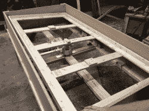](https://hackaday.com/wp-content/uploads/2012/07/img_0082.jpg)[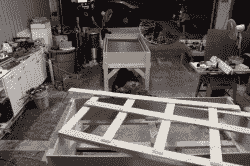](https://hackaday.com/wp-content/uploads/2012/07/img_8543.jpg)[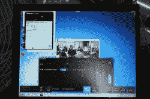](https://hackaday.com/wp-content/uploads/2012/07/img_8580.jpg)[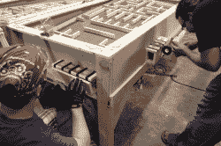](https://hackaday.com/wp-content/uploads/2012/07/img_8582.jpg)[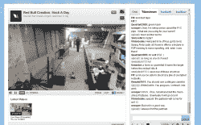](https://hackaday.com/wp-content/uploads/2012/07/hadhorns08.jpg)[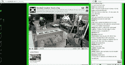](https://hackaday.com/wp-content/uploads/2012/07/hadhorns46.jpg)[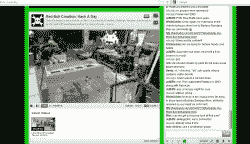](https://hackaday.com/wp-content/uploads/2012/07/hadhorns52.jpg)[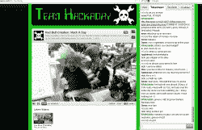](https://hackaday.com/wp-content/uploads/2012/07/hadhorns55.jpg)[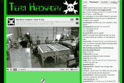](https://hackaday.com/wp-content/uploads/2012/07/hadhorns87.jpg)[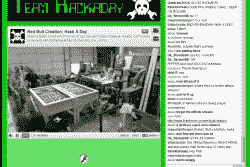](https://hackaday.com/wp-content/uploads/2012/07/hadhorns94.jpg)[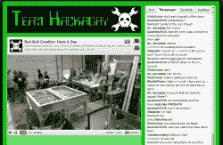](https://hackaday.com/wp-content/uploads/2012/07/hadhorns98.jpg)[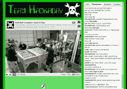](https://hackaday.com/wp-content/uploads/2012/07/hadhorns104.jpg)