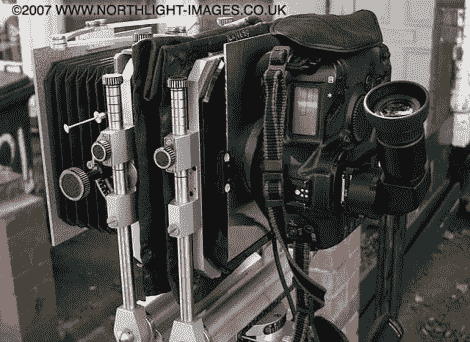

# 新相机学习旧镜头技巧

> 原文：<https://hackaday.com/2012/07/25/new-cameras-learning-old-lens-tricks/>

[Michael H]向我们透露了关于使用 DSLR 相机和镜头查看相机镜头部件的指南。我们并不熟悉“取景相机”这个术语，但我们肯定知道这种类似手风琴的风箱定义了[这种类型的相机](http://en.wikipedia.org/wiki/View_camera)。这个想法是，带有固定镜头的现代相机会错过一些类型的镜头。为什么不找出一种方法，让新旧两者都达到最佳效果呢？

观景相机背后的概念是有两个由波纹管连接的板。一个盘子装胶卷和快门，另一个装镜头。这两者可以调整焦距，但也可以设置成彼此成一定角度。这种现代的适应使用一个可调节的框架来保持两个板块的位置。定制连接器是通过将透镜环连接到板上制成的。这与我们在尝试将相机与不同制造商的镜头进行匹配时看到的连接技术非常相似。